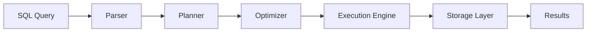

DuckDB is an **in-process analytical database** designed to provide high-performance data analytics directly embedded within applications. Unlike traditional client-server databases, DuckDB runs entirely within the host process, eliminating network overhead and simplifying deployment.

## In-Process Architecture

DuckDB is an embedded database system, similar to SQLite but optimized for analytical workloads (OLAP) rather than transactional workloads (OLTP). This means:

- **No separate server process**: DuckDB runs directly in your application's process space
- **Zero-copy integration**: Direct memory access to data structures without serialization
- **Single-file storage**: Database stored in a single file (or in-memory)
- **Thread-safe**: Multiple threads can query the same database concurrently

```cpp
// Example: Opening a DuckDB database in C API
duckdb_database db;
duckdb_connection con;

// Opens or creates a single-file database
duckdb_open("my_database.duckdb", &db);
duckdb_connect(db, &con);
```

## Core Components

DuckDB's architecture consists of several key components that work together to process queries efficiently:

<CardGroup cols={2}>
  <Card title="Parser" icon="code">
    Transforms SQL text into an Abstract Syntax Tree (AST)
  </Card>
  <Card title="Planner" icon="sitemap">
    Converts AST into a logical query plan
  </Card>
  <Card title="Optimizer" icon="gauge-high">
    Optimizes the logical plan for efficient execution
  </Card>
  <Card title="Execution Engine" icon="bolt">
    Executes the physical query plan using vectorized processing
  </Card>
</CardGroup>

### Query Flow

When you execute a SQL query in DuckDB, it flows through the following stages:



## Parser

Location: [`src/parser/`](https://github.com/duckdb/duckdb/tree/main/src/parser)

The parser is the entry point for all SQL queries. DuckDB uses a modified version of the PostgreSQL parser ([libpg_query](https://github.com/pganalyze/libpg_query)) to ensure broad SQL compatibility.

**Key responsibilities:**
- Tokenize SQL text
- Build Abstract Syntax Tree (AST)
- Perform initial syntax validation
- Transform PostgreSQL AST into DuckDB's internal representation

The parser produces statements, expressions, and table references that are passed to the planner.

## Planner

Location: [`src/planner/`](https://github.com/duckdb/duckdb/tree/main/src/planner)

The planner converts the parsed AST into a **Logical Query Plan** - a tree of `LogicalOperator` nodes representing the query's semantic meaning.

**Key responsibilities:**
- Resolve table and column names via the Catalog
- Type checking and inference
- Bind expressions to actual table columns
- Convert parsed structures to logical operators

<Info>
The planner uses the **Binder** component to resolve symbols (table names, column names, functions) against the database catalog.
</Info>

## Optimizer

Location: [`src/optimizer/`](https://github.com/duckdb/duckdb/tree/main/src/optimizer)

The optimizer transforms the logical plan into a more efficient equivalent plan. DuckDB employs both rule-based and cost-based optimization strategies.

**Key optimizations include:**

<AccordionGroup>
  <Accordion title="Expression Rewriting">
    - Constant folding: `2 + 3` → `5`
    - Arithmetic simplification: `x * 1` → `x`
    - Case simplification
    - Common subexpression elimination (CSE)
  </Accordion>
  
  <Accordion title="Filter Pushdown">
    Moves filter predicates as close to the data source as possible to reduce the amount of data processed.
    
    ```sql
    -- Filter pushed down to table scan
    SELECT * FROM users 
    WHERE age > 18 AND country = 'US'
    ```
  </Accordion>
  
  <Accordion title="Join Ordering">
    Determines optimal join order using cost-based analysis. Implemented in `src/optimizer/join_order/`.
  </Accordion>
  
  <Accordion title="Column Pruning">
    Removes unused columns early in the query plan to reduce memory usage and I/O.
  </Accordion>
  
  <Accordion title="Statistics Propagation">
    Uses table and column statistics to make informed optimization decisions.
  </Accordion>
</AccordionGroup>

From `src/optimizer/optimizer.cpp:49-78`, the optimizer applies multiple optimization rules:

```cpp
Optimizer::Optimizer(Binder &binder, ClientContext &context) : context(context), binder(binder), rewriter(context) {
    rewriter.rules.push_back(make_uniq<ConstantFoldingRule>(rewriter));
    rewriter.rules.push_back(make_uniq<DistributivityRule>(rewriter));
    rewriter.rules.push_back(make_uniq<ArithmeticSimplificationRule>(rewriter));
    rewriter.rules.push_back(make_uniq<CaseSimplificationRule>(rewriter));
    rewriter.rules.push_back(make_uniq<ConjunctionSimplificationRule>(rewriter));
    // ... and many more
}
```

## Execution Engine

Location: [`src/execution/`](https://github.com/duckdb/duckdb/tree/main/src/execution)

The execution layer converts the optimized logical plan into a **Physical Query Plan** consisting of `PhysicalOperator` nodes, then executes it using a **push-based vectorized execution model**.

**Key characteristics:**
- **Vectorized processing**: Operates on batches of rows (default 2048 rows) for CPU efficiency
- **Push-based model**: Data flows from operators to their parents
- **Parallel execution**: Automatic parallelization across multiple threads
- **Pipelined execution**: Minimizes materialization of intermediate results

See [Query Execution](/concepts/query-execution) for detailed information on vectorized execution.

## Catalog

Location: [`src/catalog/`](https://github.com/duckdb/duckdb/tree/main/src/catalog)

The catalog manages database metadata:
- Tables and their schemas
- Views
- Indexes
- User-defined functions
- Sequences
- Schemas and databases

The catalog is used by the planner's binder to resolve symbols during query planning.

## Storage Layer

Location: [`src/storage/`](https://github.com/duckdb/duckdb/tree/main/src/storage)

The storage component manages physical data on disk and in memory:
- **Columnar storage format**: Optimized for analytical queries
- **Single-file database**: All data in one `.duckdb` file
- **Buffer manager**: Intelligent memory management and caching
- **Compression**: Multiple compression algorithms per column
- **ACID compliance**: Full transaction support with Write-Ahead Log (WAL)

See [Storage System](/concepts/storage) for detailed information.

## Transaction Management

Location: [`src/transaction/`](https://github.com/duckdb/duckdb/tree/main/src/transaction)

DuckDB provides full ACID transaction support:
- **Snapshot isolation**: Each transaction sees a consistent snapshot of the database
- **Multi-Version Concurrency Control (MVCC)**: Readers don't block writers
- **Write-Ahead Logging (WAL)**: Ensures durability and crash recovery

From `src/transaction/duck_transaction_manager.cpp:36-78`, each transaction receives unique identifiers:

```cpp
DuckTransactionManager::DuckTransactionManager(AttachedDatabase &db) : TransactionManager(db) {
    // Start timestamp starts at two
    current_start_timestamp = 2;
    // Transaction ID starts very high
    current_transaction_id = TRANSACTION_ID_START;
    // ...
}
```

## Summary

DuckDB's in-process architecture provides several advantages:

<CardGroup cols={2}>
  <Card title="Performance" icon="rocket">
    No network overhead, zero-copy data access, and efficient memory usage
  </Card>
  <Card title="Simplicity" icon="star">
    Single file deployment, no server administration, embedded in applications
  </Card>
  <Card title="Portability" icon="globe">
    Runs anywhere your application runs, cross-platform support
  </Card>
  <Card title="SQL Compatibility" icon="database">
    PostgreSQL-compatible SQL with advanced analytical features
  </Card>
</CardGroup>

The modular architecture allows each component to focus on its specific task while maintaining clean interfaces between stages of query processing.

<Card title="Next Steps" icon="arrow-right">
  - Learn about [Data Types](/concepts/data-types) in DuckDB
  - Explore the [Storage System](/concepts/storage)
  - Understand [Query Execution](/concepts/query-execution)
</Card>