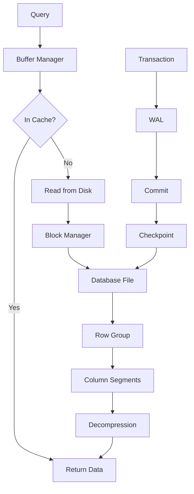

DuckDB uses a **columnar storage format** optimized for analytical workloads, combined with a **single-file architecture** for simplicity and portability. The storage system provides full ACID guarantees through Multi-Version Concurrency Control (MVCC) and Write-Ahead Logging (WAL).

## Single-File Database Design

Location: [`src/storage/`](https://github.com/duckdb/duckdb/tree/main/src/storage)

DuckDB stores all database data in a single file with the `.duckdb` extension (or in-memory). This design provides several benefits:

<CardGroup cols={2}>
  <Card title="Portability" icon="arrow-right-arrow-left">
    Copy a single file to move the entire database
  </Card>
  <Card title="Simplicity" icon="check">
    No complex directory structures or multiple files to manage
  </Card>
  <Card title="Versioning" icon="code-branch">
    Easy to version control, backup, and restore
  </Card>
  <Card title="Zero Config" icon="star">
    No server setup or configuration required
  </Card>
</CardGroup>

```cpp
// Opening a database creates or opens a single file
duckdb_database db;
duckdb_open("analytics.duckdb", &db);

// In-memory database (no file)
duckdb_open(":memory:", &db);
duckdb_open(NULL, &db);  // Also in-memory
```

### File Structure

The database file contains:
- **File Header**: Magic bytes "DUCK", version info, configuration
- **Block Manager**: Manages storage blocks on disk
- **Metadata**: Table schemas, statistics, indexes
- **Data Blocks**: Actual table data in columnar format
- **Write-Ahead Log (WAL)**: Transaction log for durability

From `src/include/duckdb/storage/storage_info.hpp:83-98`:

```cpp
class MainHeader {
public:
    static constexpr idx_t MAX_VERSION_SIZE = 32;
    static constexpr idx_t MAGIC_BYTE_SIZE = 4;
    static constexpr idx_t FLAG_COUNT = 4;
    
    // The magic bytes should be "DUCK"
    static const char MAGIC_BYTES[];
    
    // The (storage) version of the database
    uint64_t version_number;
    // ...
};
```

## Columnar Storage Format

Unlike row-oriented databases (like SQLite) that store entire rows together, DuckDB stores data **column-by-column**. This is optimal for analytical queries that typically access a subset of columns.

### Row-Oriented vs Columnar

**Row-Oriented** (OLTP databases):
```
Row 1: [id=1, name="Alice", age=30, salary=70000]
Row 2: [id=2, name="Bob",   age=25, salary=65000]
Row 3: [id=3, name="Carol", age=35, salary=80000]
```

**Columnar** (DuckDB):
```
Column id:     [1, 2, 3]
Column name:   ["Alice", "Bob", "Carol"]
Column age:    [30, 25, 35]
Column salary: [70000, 65000, 80000]
```

### Benefits of Columnar Storage

<AccordionGroup>
  <Accordion title="Better Compression">
    Similar values are stored together, leading to higher compression ratios. For example, a column of country names will have many repeated values.
    
    ```sql
    -- Country column might compress from MB to KB
    SELECT country, COUNT(*) FROM users GROUP BY country;
    ```
  </Accordion>
  
  <Accordion title="Reduced I/O">
    Only read the columns you need. If a query only accesses 3 out of 50 columns, you only read ~6% of the data.
    
    ```sql
    -- Only reads 'name' and 'email' columns, skips other 48 columns
    SELECT name, email FROM users WHERE age > 30;
    ```
  </Accordion>
  
  <Accordion title="Vectorized Processing">
    Columnar data is ideal for SIMD operations and cache-friendly batch processing.
  </Accordion>
  
  <Accordion title="Better Statistics">
    Column-level min/max values enable efficient query pruning and optimization.
  </Accordion>
</AccordionGroup>

## Row Groups

Data is organized into **row groups** - horizontal partitions of the table containing a fixed number of rows.

From `src/include/duckdb/storage/storage_info.hpp:22-54`:

```cpp
// The standard row group size
#define DEFAULT_ROW_GROUP_SIZE 122880ULL

struct Storage {
    // The maximum row group size
    constexpr static const idx_t MAX_ROW_GROUP_SIZE = 1ULL << 30ULL;  // 1 billion
    // ...
};
```

**Default row group size**: 122,880 rows (60 vectors of 2,048 rows)

### Row Group Structure

Each row group contains:
- **Column segments**: Compressed column data
- **Version information**: For MVCC transaction visibility
- **Statistics**: Min/max values, null counts, distinct counts
- **Metadata pointers**: Links to compression info and data blocks

From `src/storage/table/row_group.cpp:32-36`:

```cpp
RowGroup::RowGroup(RowGroupCollection &collection_p, idx_t count)
    : SegmentBase<RowGroup>(count), collection(collection_p), 
      version_info(nullptr), deletes_is_loaded(false),
      allocation_size(0), row_id_is_loaded(false), has_changes(false) {
    Verify();
}
```

### Why Row Groups?

- **Parallelism**: Different threads can scan different row groups concurrently
- **Pruning**: Skip entire row groups based on statistics (zone maps)
- **Compression**: Each row group can use optimal compression for its data
- **Memory Management**: Load/unload row groups as needed

```sql
-- DuckDB can skip row groups where max(age) < 50
SELECT * FROM users WHERE age > 50;
```

## Block Management

Storage is divided into fixed-size **blocks** that are the unit of I/O and caching.

From `src/include/duckdb/storage/storage_info.hpp:29-64`:

```cpp
// The default block allocation size
#define DEFAULT_BLOCK_ALLOC_SIZE 262144ULL  // 256 KB

struct Storage {
    // The minimum block allocation size
    constexpr static idx_t MIN_BLOCK_ALLOC_SIZE = 16384ULL;   // 16 KB
    // The maximum block allocation size  
    constexpr static idx_t MAX_BLOCK_ALLOC_SIZE = 262144ULL;  // 256 KB
    // The default block header size
    constexpr static idx_t DEFAULT_BLOCK_HEADER_SIZE = sizeof(idx_t);  // 8 bytes
    // The default block size (excluding header)
    constexpr static idx_t DEFAULT_BLOCK_SIZE = DEFAULT_BLOCK_ALLOC_SIZE - DEFAULT_BLOCK_HEADER_SIZE;
};
```

**Block sizes**:
- Default allocation: 256 KB
- Configurable range: 16 KB to 256 KB
- Header overhead: 8 bytes

### Buffer Manager

Location: `src/storage/buffer_manager.cpp`

The buffer manager handles:
- **Memory allocation**: Intelligent caching of frequently accessed blocks
- **Eviction policies**: LRU-based eviction when memory is full
- **Pinning**: Keep critical blocks in memory
- **Dirty tracking**: Track modified blocks for write-back

```cpp
// Example: Reading data through buffer manager
// 1. Request block from buffer manager
// 2. If in cache: return immediately (cache hit)
// 3. If not in cache: read from disk, cache it (cache miss)
// 4. Evict old blocks if memory limit reached
```

## Compression

Location: `src/storage/compression/`

DuckDB applies **per-column compression** automatically, choosing the best algorithm based on data characteristics.

### Compression Algorithms

| Algorithm | Best For | Description |
|-----------|----------|-------------|
| **Uncompressed** | Random data | No compression overhead |
| **Constant** | All same values | Stores single value |
| **RLE** (Run-Length Encoding) | Repeated values | `[A,A,A,B,B,C]` → `[A×3,B×2,C×1]` |
| **Dictionary** | Low cardinality | String → Integer mapping |
| **BitPacking** | Small integers | Pack values in fewer bits |
| **Frame of Reference** | Clustered numbers | Store offset from base |
| **ALP** (Adaptive Lossless) | Floating-point | Specialized for doubles |
| **FSST** | Strings | Symbol table compression |
| **Chimp/Patas** | Time series | Specialized for timestamps |

```sql
-- DuckDB automatically chooses compression per column
CREATE TABLE sales (
    date DATE,           -- Likely Frame-of-Reference
    product VARCHAR,     -- Likely Dictionary or FSST
    quantity INTEGER,    -- Likely BitPacking
    price DECIMAL(10,2)  -- Likely ALP or Frame-of-Reference
);
```

<Info>
Compression is transparent to queries - data is automatically decompressed during scans.
</Info>

## ACID Properties

DuckDB provides full ACID (Atomicity, Consistency, Isolation, Durability) transaction support.

### Atomicity

Transactions are all-or-nothing:

```sql
BEGIN TRANSACTION;
    INSERT INTO accounts VALUES (1, 1000);
    UPDATE accounts SET balance = balance - 100 WHERE id = 1;
    -- If any statement fails, all changes are rolled back
COMMIT;
```

### Consistency

Database constraints are enforced:

```sql
CREATE TABLE users (
    id INTEGER PRIMARY KEY,
    email VARCHAR UNIQUE NOT NULL,
    age INTEGER CHECK (age >= 0)
);

-- This will fail and be rolled back
INSERT INTO users VALUES (1, NULL, -5);
```

### Isolation

DuckDB uses **Multi-Version Concurrency Control (MVCC)** to provide snapshot isolation.

#### How MVCC Works

1. Each transaction gets a unique timestamp
2. Multiple versions of rows can exist simultaneously
3. Readers see a consistent snapshot (no locks needed)
4. Writers create new versions without blocking readers

From `src/transaction/duck_transaction_manager.cpp:36-78`:

```cpp
DuckTransactionManager::DuckTransactionManager(AttachedDatabase &db) {
    // Start timestamp starts at two
    current_start_timestamp = 2;
    // Transaction ID starts very high
    current_transaction_id = TRANSACTION_ID_START;
    lowest_active_id = TRANSACTION_ID_START;
    lowest_active_start = MAX_TRANSACTION_ID;
    // ...
}

Transaction &DuckTransactionManager::StartTransaction(ClientContext &context) {
    // Obtain the start time and transaction ID
    transaction_t start_time = current_start_timestamp++;
    transaction_t transaction_id = current_transaction_id++;
    // ...
}
```

**Isolation levels**:
```sql
-- DuckDB provides snapshot isolation by default
BEGIN TRANSACTION;
    -- This transaction sees a consistent snapshot from its start time
    SELECT COUNT(*) FROM users;  -- Always returns the same count
COMMIT;
```

### Durability

#### Write-Ahead Log (WAL)

Location: `src/storage/write_ahead_log.cpp`

The WAL ensures durability by logging all changes before they're applied to the database file.

**WAL Process**:
1. Transaction modifies data → changes written to WAL first
2. WAL entry flushed to disk
3. Transaction commits
4. Changes asynchronously applied to main database file
5. Periodically, checkpoint flushes all changes and truncates WAL

From `src/storage/write_ahead_log.cpp:27-36`:

```cpp
constexpr uint64_t WAL_VERSION_NUMBER = 2;
constexpr uint64_t WAL_ENCRYPTED_VERSION_NUMBER = 3;

WriteAheadLog::WriteAheadLog(StorageManager &storage_manager, 
                             const string &wal_path, idx_t wal_size,
                             WALInitState init_state, 
                             optional_idx checkpoint_iteration)
    : storage_manager(storage_manager), wal_path(wal_path), 
      init_state(init_state), checkpoint_iteration(checkpoint_iteration) {
    // ...
}
```

**Recovery after crash**:
1. Database opens and detects incomplete transactions in WAL
2. Replays committed transactions from WAL
3. Rolls back uncommitted transactions
4. Database returns to consistent state

```sql
-- Even if power fails during this transaction,
-- either all changes are applied or none are
BEGIN TRANSACTION;
    INSERT INTO orders VALUES (...);
    UPDATE inventory SET quantity = quantity - 1;
COMMIT;  -- Guaranteed durable after COMMIT returns
```

## Checkpointing

Location: `src/storage/checkpoint_manager.cpp`

**Checkpointing** is the process of:
1. Flushing all in-memory changes to the database file
2. Writing updated metadata and statistics
3. Truncating the WAL

Checkpoints occur:
- Automatically when WAL grows too large
- On clean database shutdown
- When explicitly requested via `CHECKPOINT`

```sql
-- Force a checkpoint
CHECKPOINT;

-- Or use PRAGMA
PRAGMA force_checkpoint;
```

## Storage Internals Summary



## Performance Characteristics

<CardGroup cols={2}>
  <Card title="Sequential Scans" icon="forward">
    **Excellent** - Columnar format and compression minimize I/O
  </Card>
  <Card title="Aggregations" icon="calculator">
    **Excellent** - Read only needed columns, vectorized processing
  </Card>
  <Card title="Point Lookups" icon="magnifying-glass">
    **Good** - Supported via indexes, but not primary use case
  </Card>
  <Card title="Bulk Inserts" icon="file-arrow-up">
    **Excellent** - Batch-oriented, optimized for analytics
  </Card>
</CardGroup>

## Best Practices

<Steps>
  <Step title="Choose Appropriate Types">
    Use the smallest type that fits your data. `TINYINT` (1 byte) vs `BIGINT` (8 bytes) affects storage and performance.
  </Step>
  
  <Step title="Partition Large Tables">
    For very large datasets, consider partitioning by date or other keys to improve pruning.
    
    ```sql
    CREATE TABLE events_2026_01 AS 
    SELECT * FROM events WHERE date >= '2026-01-01' AND date < '2026-02-01';
    ```
  </Step>
  
  <Step title="Use Statistics">
    DuckDB maintains column statistics automatically. These enable row group pruning.
  </Step>
  
  <Step title="Checkpoint Regularly">
    For write-heavy workloads, periodic checkpoints prevent WAL from growing too large.
  </Step>
  
  <Step title="Monitor Memory Usage">
    Configure buffer pool size based on available RAM:
    
    ```sql
    SET memory_limit = '4GB';
    SET threads = 4;
    ```
  </Step>
</Steps>

## Configuration Options

```sql
-- Memory limit
SET memory_limit = '8GB';

-- Checkpoint threshold
SET checkpoint_threshold = '1GB';

-- Access mode
SET access_mode = 'READ_ONLY';  -- For read-only workloads

-- Temp directory for spilling
SET temp_directory = '/fast/ssd/temp';
```

<Card title="Next Steps" icon="arrow-right">
  - Learn about [Query Execution](/concepts/query-execution) and how queries process this data
  - Explore [Data Types](/concepts/data-types) and their storage characteristics
  - Read the [Architecture Overview](/concepts/architecture)
</Card>