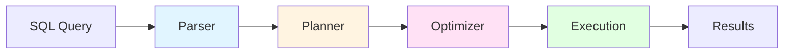

DuckDB is structured as a modular analytical database system. This guide provides an overview of the codebase architecture to help you navigate and contribute to the project.

## Source Code Organization

The DuckDB source tree is organized under the `src/` directory:

```
src/
├── catalog/          # Schema and metadata management
├── common/           # Shared utilities and data structures
├── execution/        # Query execution engine
├── function/         # Built-in functions
├── include/          # Public header files
├── main/             # Database instance and connections
├── optimizer/        # Query optimization
├── parser/           # SQL parsing
├── planner/          # Logical query planning
├── storage/          # Storage and buffer management
├── transaction/      # Transaction management
└── parallel/         # Parallelization utilities
```

## Query Processing Pipeline

Queries in DuckDB flow through a multi-stage pipeline:



### 1. Parser

**Location:** `src/parser/`

The parser is the entry point for SQL queries.

#### Key Components

- **libpg_query integration**: DuckDB uses PostgreSQL's parser ([libpg_query](https://github.com/pganalyze/libpg_query))
- **Custom AST**: Transforms PostgreSQL tokens into DuckDB's internal representation
- **Output**: Tree of `SQLStatement`, `Expression`, and `TableRef` nodes

#### Main Classes

- `SQLStatement` - Base class for all statements (SELECT, INSERT, etc.)
- `ParsedExpression` - Represents expressions (columns, operators, functions)
- `TableRef` - Represents table references in FROM clauses

#### Example

```sql
SELECT name, age FROM users WHERE age > 18;
```

Parses to:
- `SelectStatement` containing:
  - Select list: `ColumnRef(name)`, `ColumnRef(age)`
  - From: `BaseTableRef(users)`
  - Where: `ComparisonExpression(age > 18)`

### 2. Planner

**Location:** `src/planner/`

Converts parsed AST into a logical query plan.

#### Responsibilities

- **Binding**: Resolve table/column names using the catalog
- **Type resolution**: Determine result types for expressions
- **Logical plan creation**: Build tree of `LogicalOperator` nodes

#### Key Components

- `Binder` - Resolves symbols and creates bound nodes
- `LogicalOperator` - Base class for logical plan nodes
- Operators:
  - `LogicalGet` - Table scan
  - `LogicalFilter` - WHERE clause
  - `LogicalProjection` - SELECT list
  - `LogicalJoin` - JOIN operations
  - `LogicalAggregate` - GROUP BY aggregations

#### Example Plan

For the query above:
```
LogicalProjection (name, age)
  └── LogicalFilter (age > 18)
        └── LogicalGet (users)
```

### 3. Optimizer

**Location:** `src/optimizer/`

Transforms logical plans into more efficient equivalent plans.

#### Optimization Techniques

**Rule-based optimizations:**
- **Predicate pushdown**: Move filters closer to data sources
- **Projection pushdown**: Only read required columns
- **Expression rewriting**: Simplify expressions
- **Common subexpression elimination**: Reuse computed values

**Cost-based optimizations:**
- **Join ordering**: Find optimal join sequence
- **Join type selection**: Choose hash join vs. nested loop join
- **Index selection**: Use available indexes

#### Key Classes

- `Optimizer` - Main optimization driver
- `Rule` - Base class for optimization rules
- `OptimizerExtension` - Extension point for custom optimizations

#### Example Transformation

**Before optimization:**
```
LogicalProjection (name)
  └── LogicalFilter (age > 18)
        └── LogicalGet (users) [reads: id, name, age, email]
```

**After optimization:**
```
LogicalProjection (name)
  └── LogicalGet (users) [reads: name, age, filter: age > 18]
```

### 4. Execution

**Location:** `src/execution/`

Executes the optimized query plan and produces results.

#### Architecture

- **Physical plan**: Converts `LogicalOperator` to `PhysicalOperator`
- **Push-based execution**: Operators push data chunks to parents
- **Vectorized processing**: Operates on batches of rows (default: 2048)
- **Parallel execution**: Automatic parallelization of operators

#### Key Components

- `PhysicalOperator` - Base class for execution operators
- `DataChunk` - Vectorized batch of rows (columnar format)
- `ExecutionContext` - Runtime state and resources

#### Physical Operators

| Logical | Physical | Description |
|---------|----------|-------------|
| `LogicalGet` | `PhysicalTableScan` | Sequential table scan |
| `LogicalFilter` | `PhysicalFilter` | Apply filter predicates |
| `LogicalJoin` | `PhysicalHashJoin` | Hash-based join |
| `LogicalAggregate` | `PhysicalHashAggregate` | Hash-based aggregation |
| `LogicalProjection` | `PhysicalProjection` | Compute expressions |

#### Vectorized Execution

DuckDB processes data in columnar batches:

```cpp
// DataChunk represents a batch of rows
DataChunk chunk;
chunk.Initialize({LogicalType::INTEGER, LogicalType::VARCHAR});

// Vectors within chunk (column-oriented)
Vector &ids = chunk.data[0];      // Column of integers
Vector &names = chunk.data[1];    // Column of strings
chunk.SetCardinality(2048);       // Up to 2048 rows
```

## Core Components

### Catalog

**Location:** `src/catalog/`

Manages database metadata and schema information.

#### Structure

```
Catalog
  └── Schema
        ├── Tables
        ├── Views
        ├── Indexes
        └── Functions
```

#### Key Classes

- `Catalog` - Top-level catalog container
- `SchemaCatalogEntry` - Schema (namespace) entry
- `TableCatalogEntry` - Table metadata
- `StandardEntry` - Base class for catalog entries

#### Usage

```cpp
// Resolve a table during binding
auto &catalog = Catalog::GetCatalog(context);
auto &schema = catalog.GetSchema(context, "main");
auto table = schema.GetEntry<TableCatalogEntry>(context, "users");
```

### Storage

**Location:** `src/storage/`

Manages physical data storage, both in-memory and on-disk.

#### Components

**Buffer Manager:**
- Manages in-memory buffer pool
- Handles eviction and loading of blocks
- Coordinates with disk I/O

**Table Storage:**
- **Row groups**: Data organized in horizontal partitions
- **Column segments**: Columnar storage within row groups
- **Compression**: Automatic compression of column data

**Transaction Support:**
- MVCC (Multi-Version Concurrency Control)
- Optimistic concurrency control
- ACID guarantees

#### Storage Format

```
Table
  └── Row Groups (122,880 rows each)
        └── Column Segments
              ├── Data blocks
              ├── Validity mask (NULL tracking)
              └── Statistics (min/max/count)
```

### Transaction Management

**Location:** `src/transaction/`

Provides ACID transaction support.

#### Features

- **Isolation**: Snapshot isolation using MVCC
- **Atomicity**: All-or-nothing commit/rollback
- **Durability**: Write-Ahead Logging (WAL)
- **Consistency**: Constraint enforcement

#### Key Classes

- `Transaction` - Represents an active transaction
- `TransactionManager` - Coordinates transaction lifecycle
- `WriteAheadLog` - Ensures durability

### Functions

**Location:** `src/function/`

Built-in functions (scalar, aggregate, table).

#### Function Types

**Scalar Functions:**
```cpp
// Example: UPPER(string)
ScalarFunction upper("upper", {LogicalType::VARCHAR}, 
                     LogicalType::VARCHAR, UpperFunction);
```

**Aggregate Functions:**
```cpp
// Example: SUM(value)
AggregateFunction sum("sum", {LogicalType::INTEGER},
                     LogicalType::BIGINT, 
                     SumState::Initialize,
                     SumState::Update,
                     SumState::Combine,
                     SumState::Finalize);
```

**Table Functions:**
```cpp
// Example: read_csv('file.csv')
TableFunction read_csv("read_csv", {LogicalType::VARCHAR},
                      ReadCSVBind, ReadCSVInit, ReadCSV);
```

## Development Workflow

### Making Changes

<Steps>

<Step title="Identify the component">

Determine which part of the codebase to modify:
- SQL syntax changes → `parser/`
- New operator → `planner/` + `execution/`
- Optimization → `optimizer/`
- Storage format → `storage/`
- Built-in function → `function/`

</Step>

<Step title="Implement changes">

Follow DuckDB coding standards:
- Use tabs for indentation
- `CamelCase` for types and functions
- `snake_case` for variables
- Const correctness
- Smart pointers over raw pointers

</Step>

<Step title="Add tests">

Prefer SQL logic tests:
```sql
# test/sql/myfeature/basic.test
statement ok
CREATE TABLE test(i INTEGER);

query I
SELECT my_new_function(i) FROM test;
----
expected_result
```

</Step>

<Step title="Run tests and format">

```bash
make unit            # Fast tests
make format-fix      # Format code
make allunit         # All tests before PR
```

</Step>

</Steps>

### Code Navigation Tips

**Finding implementations:**
```bash
# Find where a function is defined
grep -r "FunctionName" src/

# Find operator implementations
find src/execution/physical_operator -name "*.cpp"

# Find SQL logic tests
find test/sql -name "*.test" | grep keyword
```

**Understanding query execution:**
1. Set breakpoint in parser for your query type
2. Follow through planner binding
3. Watch optimizer transformations
4. Step into physical operator execution

## Extension System

DuckDB supports loadable extensions.

### Extension Structure

```
extension/
  └── my_extension/
        ├── CMakeLists.txt
        ├── my_extension.cpp      # Entry point
        └── include/
              └── my_extension.hpp
```

### Extension Entry Point

```cpp
void MyExtensionLoad(DuckDB &db) {
    // Register functions
    auto &catalog = Catalog::GetCatalog(db);
    catalog.AddFunction(db, MyFunction());
}

void MyExtensionVersion(DatabaseInstance &db) {
    // Return version info
}
```

## Debugging Tips

### Enable Debug Logging

```cpp
#include "duckdb/common/printer.hpp"

Printer::Print("Debug message: " + value.ToString());
```

### Query Profiling

```sql
PRAGMA enable_profiling;
SELECT * FROM large_table;
PRAGMA profiling_output;
```

### Explain Plans

```sql
EXPLAIN SELECT * FROM users WHERE age > 18;
```

Shows the physical execution plan.

## Resources

<CardGroup cols={2}>
  <Card title="Building" icon="hammer" href="/development/building">
    Build DuckDB from source
  </Card>
  <Card title="Testing" icon="flask" href="/development/testing">
    Write and run tests
  </Card>
  <Card title="Contributing" icon="code-pull-request" href="/development/contributing">
    Contribution guidelines
  </Card>
  <Card title="Source README" icon="book" href="https://github.com/duckdb/duckdb/blob/main/src/README.md">
    Official source documentation
  </Card>
</CardGroup>